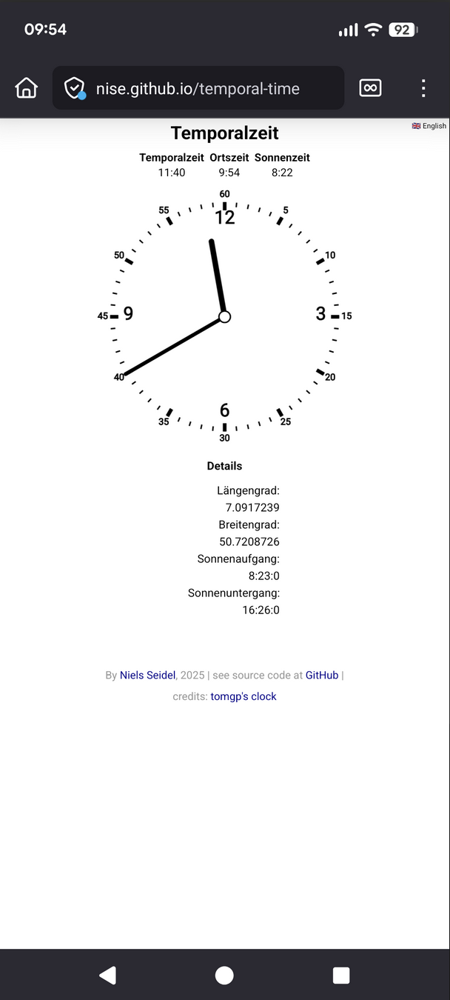

# Temporal Time

This project contains a progressiv web app that displays the temporal time as a clock. The temporal time is calculated in three steps:

1. Get geo location of the user
2. Request the time of today's sunset and sunrise considering the geo position
3. Transform the local time to temporal time by spliting the time between sunrise and sunset (during the day) in 12 equal parts (temporal hours) and adjust the minutes accordingly.

**See the demo:** https://nise.github.io/temporal-time/



## Temporal Time Algorithm

```
FUNCTION calculateTemporalTime():
    // Initialization
    now ← current_time()
    dayLength ← sunset - sunrise
    nightLength ← 24h - dayLength

    // Night or day?
    IF (now ≥ sunset OR now < sunrise):
        // Night calculation
        IF (now ≥ sunset):
            progress ← now - sunset
        ELSE:
            progress ← (24h - sunset) + now

        ratio ← progress / nightLength

    ELSE:
        // Day calculation
        progress ← now - sunrise
        ratio ← progress / dayLength

    // Calculate temporal time
    totalMinutes ← ratio × 720 // × 12 hours
    temporalHour ← ⌊totalMinutes / 60⌋ + 1    // 1-12
    temporalMinute ← ⌊totalMinutes mod 60⌋

    RETURN (temporalHour, temporalMinute)
```

# Contributor

Niels Seidel
